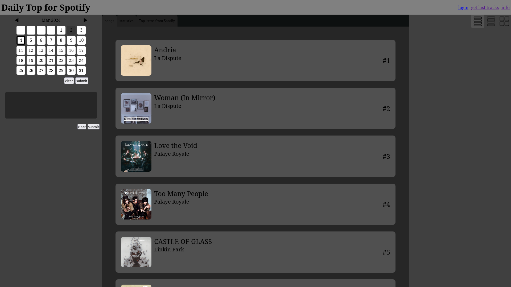
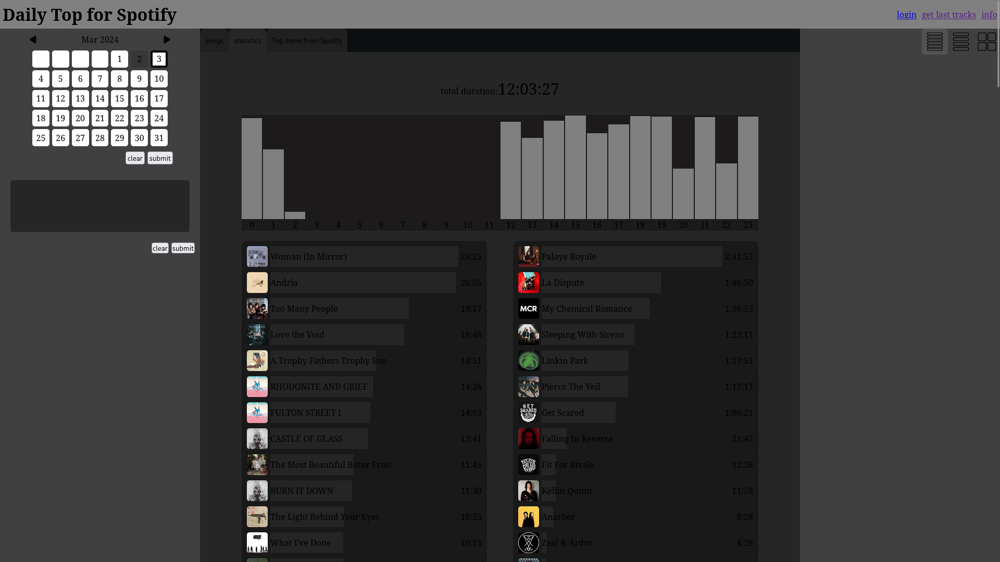

# Daily Top For Spotify
local server for tracking and viewing your Spotify stats

## Configuration
Login to the Spotify Developer Dashboard and create you new "App". You can visit Spotify docs for more [info](https://developer.spotify.com/documentation/web-api/tutorials/getting-started#create-an-app)</br>
Add "http://localhost:5000/auth/callback" as new "Redirect URIs" </br>
rename/copy `configTemplate.json` to `config.json` </br>
`cp configTemplate.json config.json`

and fill out 
`SPOTIFY_CLIENT_ID` and `SPOTIFY_CLIENT_SECRET` from the spotify app settings </br>

## Set up MongoDB
start mongodb service `sudo systemctl start mongodb.service`

connect to the database with `mongosh`

list all databases `show databases`

create a database called "dailyTopForSpotify" `use dailyTopForSpotify`

set up the database:
```
db.createCollection("history")

db.createCollection("set")
db.set.createIndex({"songId": 1}, {unique: true})
```

## Images



<!-- ## Setup a database -->
<!-- install mongodb -->
