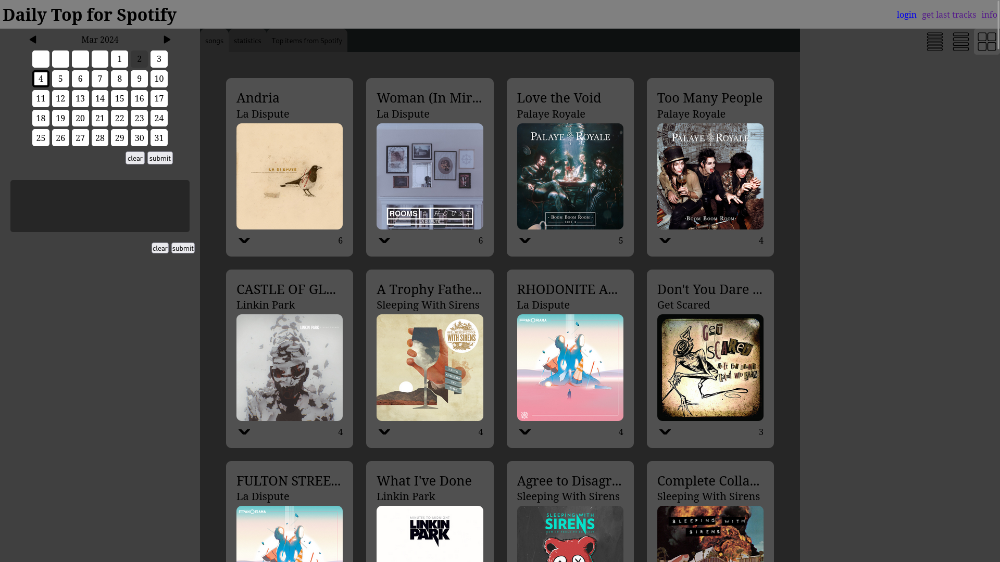

# Daily Top For Spotify
local server for tracking and viewing your Spotify stats

## Configuration
Login to the Spotify Developer Dashboard and create you new "App". You can visit Spotify docs for more [info](https://developer.spotify.com/documentation/web-api/tutorials/getting-started#create-an-app)</br>
Add "http://localhost:5000/auth/callback" as new "Redirect URIs" </br>
rename/copy `configTemplate.json` to `Data/config.json` </br>
`cp configTemplate.json Data/config.json`

and fill out 
`SPOTIFY_CLIENT_ID` and `SPOTIFY_CLIENT_SECRET` from the spotify app settings </br>

## Set up MongoDB
start mongodb service `sudo systemctl start mongodb.service`

connect to the database with `mongosh`

list all databases `show databases`

create a database called "dailyTopForSpotify" `use dailyTopForSpotify`

set up the database:
```
db.createCollection("history")

db.createCollection("songsSet")
db.songsSet.createIndex({"songId": 1}, {unique: true})

db.createCollection("artistsSet")
db.artistsSet.createIndex({"artistId": 1}, {unique: true})
```

## Deployment
install forever and then run `npm install -g forever` and then run `npm run production` </br>
now you can visite http://127.0.0.1:5000/

## Montoring
to see the logs made by the server use `forever logs server.js` to get the file path of the log file then use 
`tail -f [fileLogName]` for example `tail -f ~/.forever/X5Zf.log`

## Images




<!-- ## Setup a database -->
<!-- install mongodb -->

## Changes
```
db.set.renameCollection("songsSet");

db.createCollection("artistsSet")
db.artistsSet.createIndex({"artistId": 1}, {unique: true})

// make backup
db.songsSetCopy.insertMany(db.songsSet.find({}).toArray())

db.songsSet.updateMany({},
  [
    {
      $set: {
        artists: {
          $map: {
            input: "$artists",
            as: "artist",
            in: "$$artist.id"
          }
        }
      }
    }
  ]
);
```
